# Data-Visualization  
Olist E-commerce Analytics  

Olist is a Brazilian e-commerce marketplace that connects small businesses with major online platforms.  
This repository contains a **data analytics project** for the Olist e-commerce dataset (orders, customers, sellers, products, reviews, payments, geolocation).  

The goal is to perform **sales and logistics analytics**: customer behavior, seller activity, order statistics, payment types, delivery times, product categories, and review scores.  

---

## ERD Diagram  

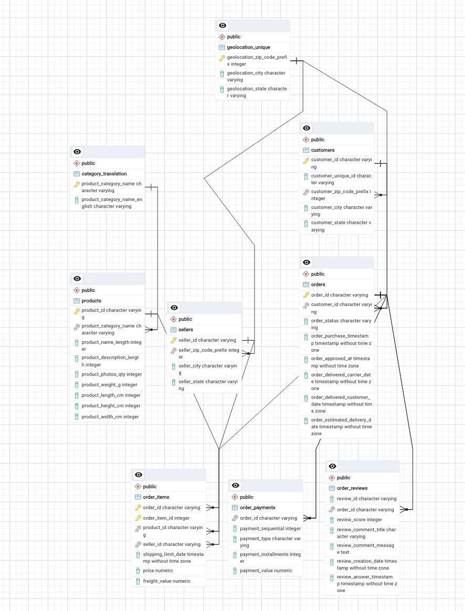  

---

## Dataset  

Files (CSV) used in the project (stored in `db/`):  

- `orders.csv` — order details and timestamps  
- `customers.csv` — customer demographic and location data  
- `sellers.csv` — seller information  
- `products.csv` — product metadata and categories  
- `order_items.csv` — products included in orders  
- `order_payments.csv` — payments and methods used  
- `order_reviews.csv` — reviews and ratings from customers  
- `geolocation.csv` — customer and seller locations  
- `category_translation.csv` — translation of product categories into English  

---

## Contents of the repository  

- `schema.sql` — CREATE TABLE statements for all tables 
- `queries.sql` — 10 analytical SQL queries  
- `main.py` — Python script to connect to the DB and run sample queries  
- `db/` — CSV files 
- `images/` — ER diagram and screenshots of query results  
- `data.sql` — SQL commands to import CSV files into PostgreSQL  

---
## Queries

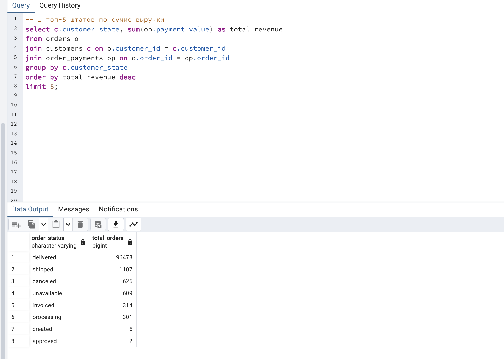  
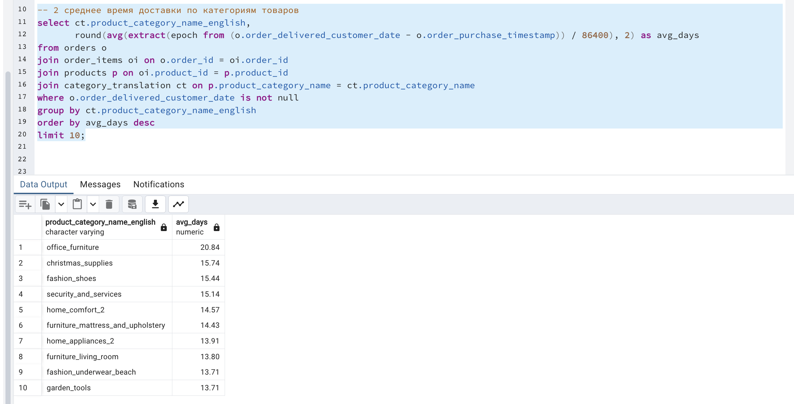 

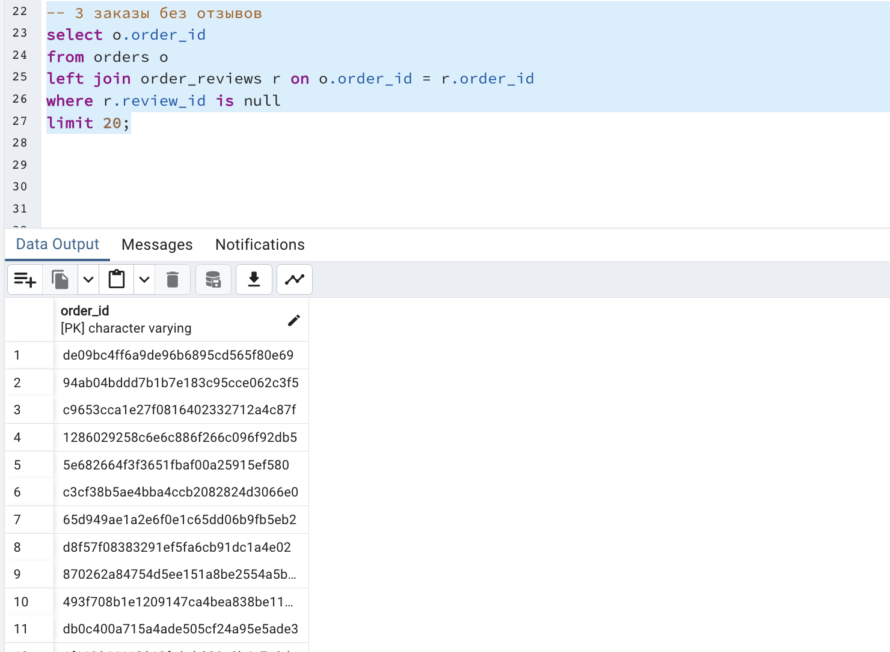 
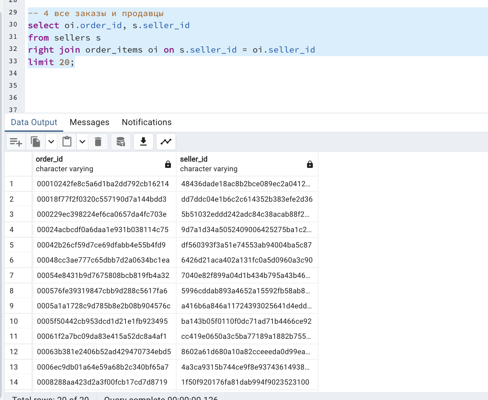 
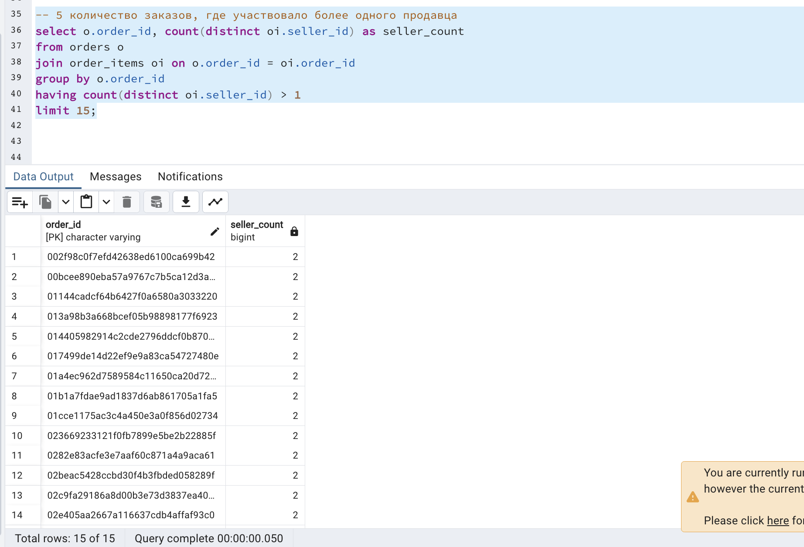 
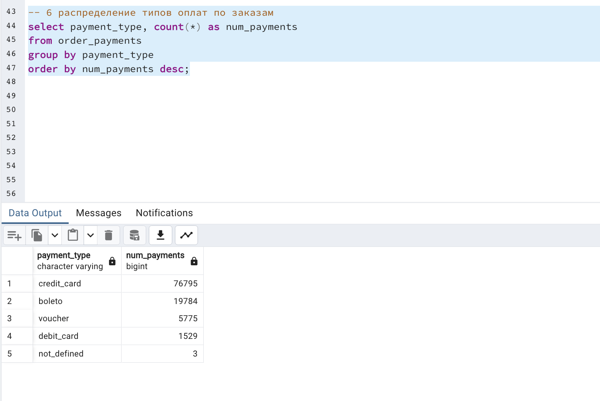 
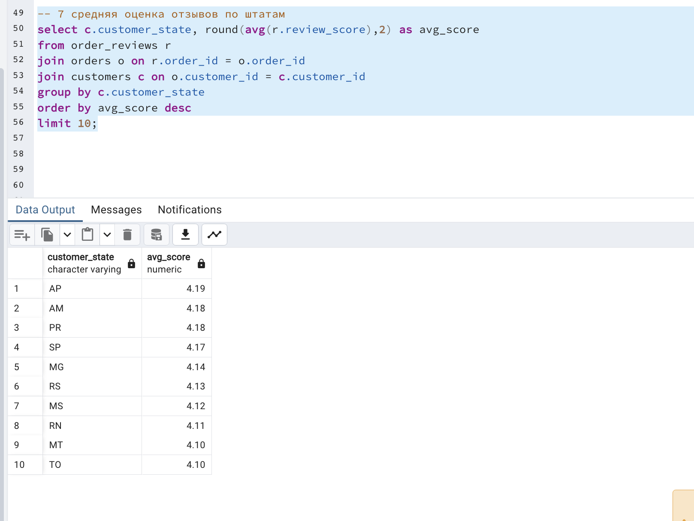 
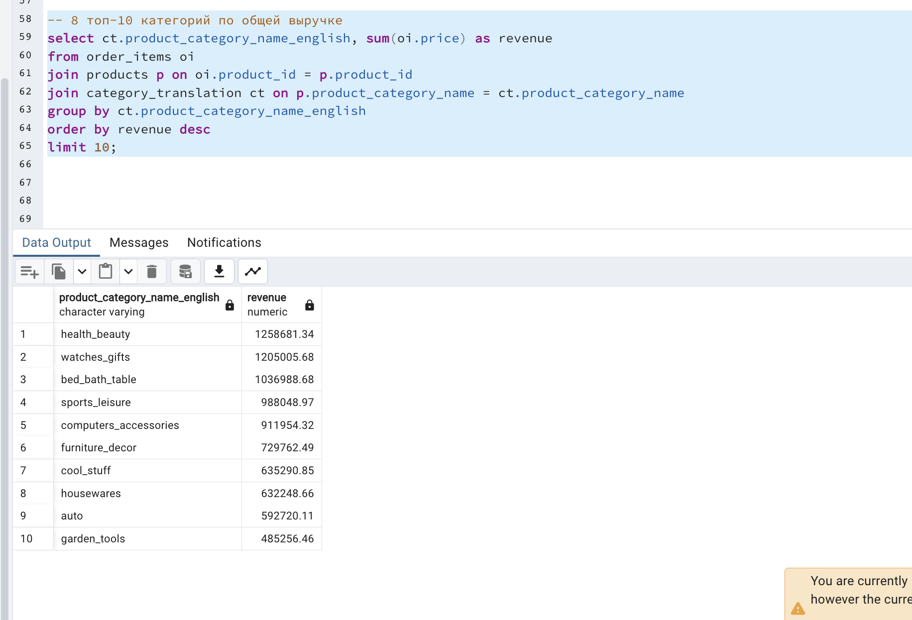 
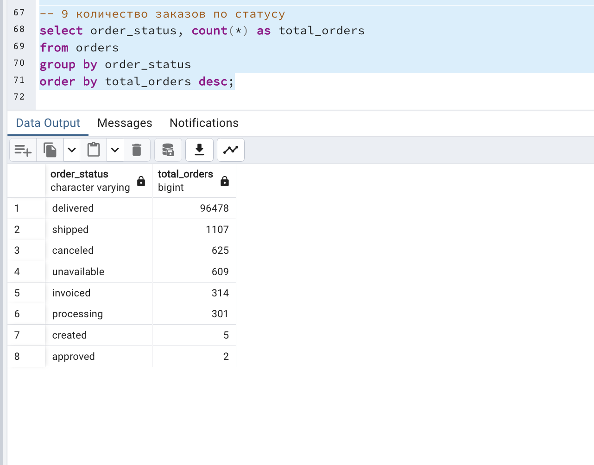 
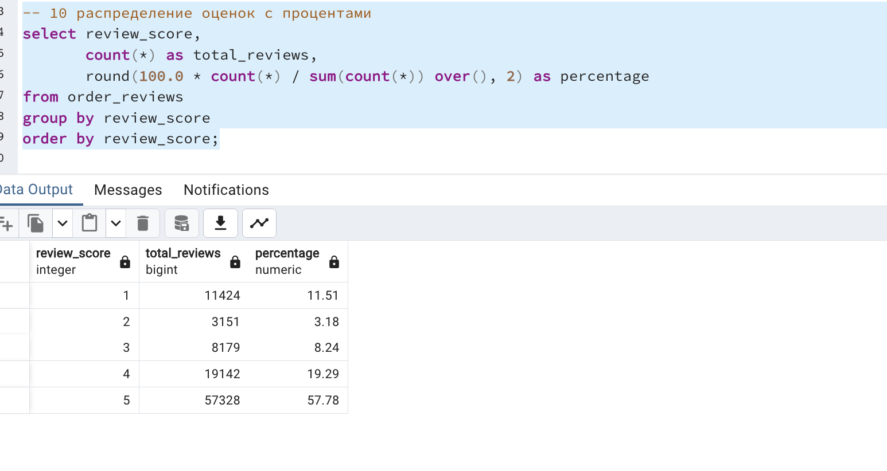 

-
---

## Quick setup & run instructions  

### 1. Prerequisites  
- macOS / Linux / Windows  
- PostgreSQL 16 (or compatible) installed and running  
- pgAdmin (optional, for GUI and ERD)  
- Python 3.12+  
- Git and optionally the GitHub CLI (`gh`)  

---
### 2. Create PostgreSQL database
- createdb ecommerce

## Or in psql:

- create database ecommerce;
- Create tables

### 3. Run the schema.sql file (contains CREATE TABLE statements):

psql -U postgres -d ecommerce -f schema.sql

### 4. Import CSV data

Recommended: use client-side \copy (works without server file permissions).

psql -U postgres -d ecommerce

Then inside the psql shell:

\i data.sql

### 5. Run analytical queries

Open queries.sql and run queries in pgAdmin or psql to verify results:

psql -U postgres -d ecommerce -f queries.sql

### 6. Run Python script

main.py connects to the DB, runs a few queries and prints results. Example:

python main.py

### Example output:

   count
0  99441

  payment_type         avg
0  not_defined    0.000000
1       boleto  145.034435
2   debit_card  142.570170
3      voucher   65.703354
4  credit_card  163.319021

### Tools & resources

PostgreSQL 16 (server)

pgAdmin 4 (GUI for DB)

Python 3.12+, pip

Libraries: psycopg2, pandas, sqlalchemy

Apache Superset (optional dashboard)

VS Code / PyCharm for editing

### Project author

Ayaulym Orynbassarova
Astana IT University
